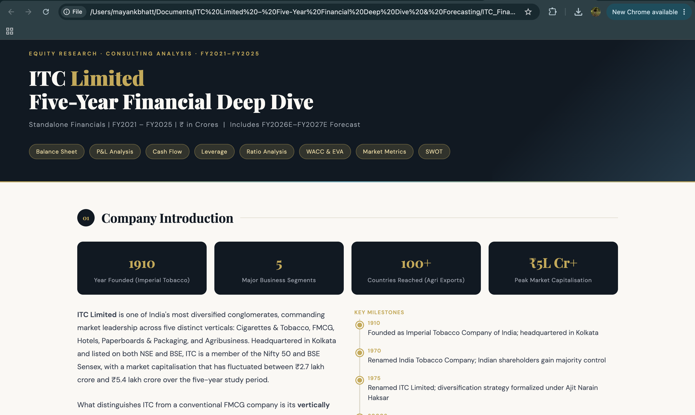
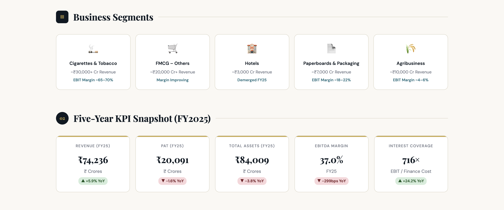
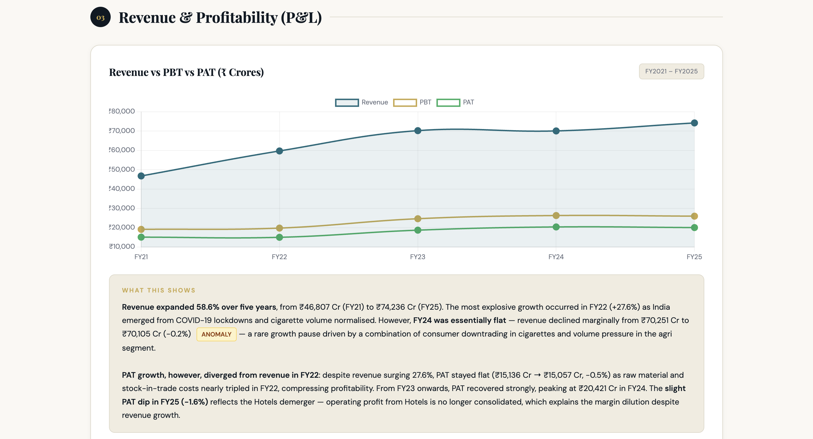
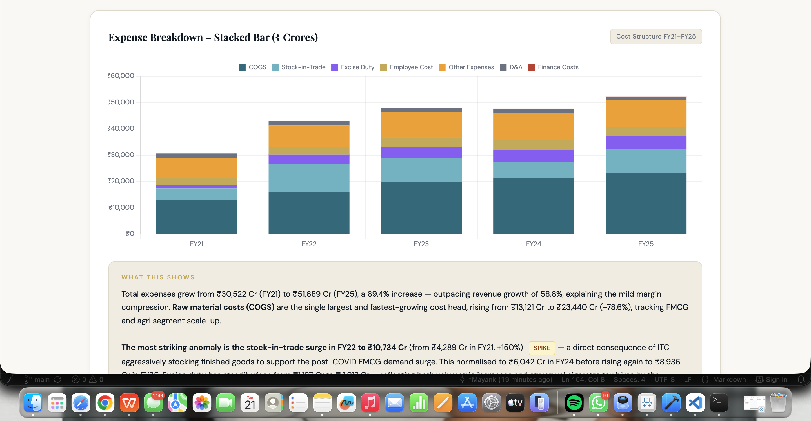
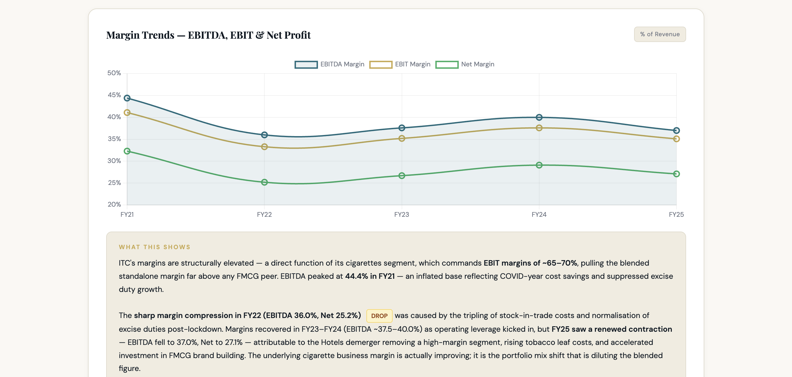
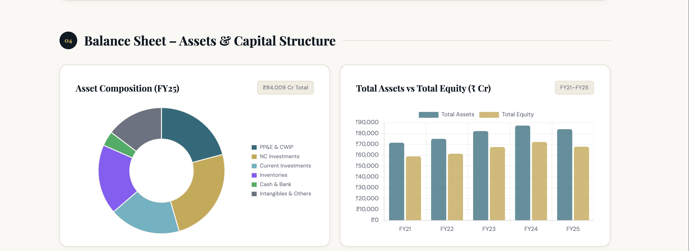
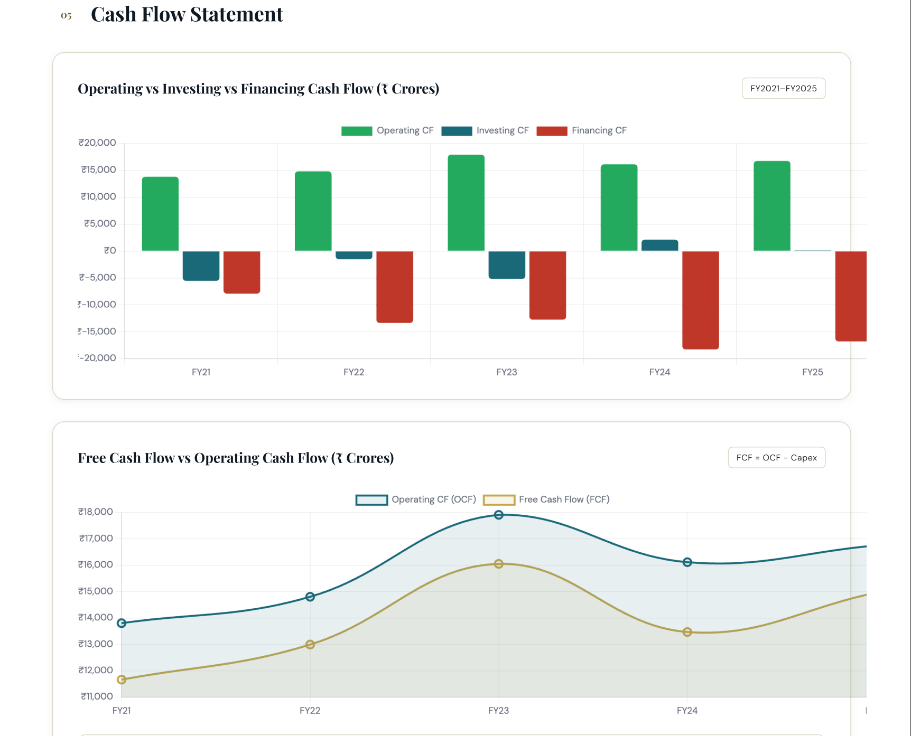
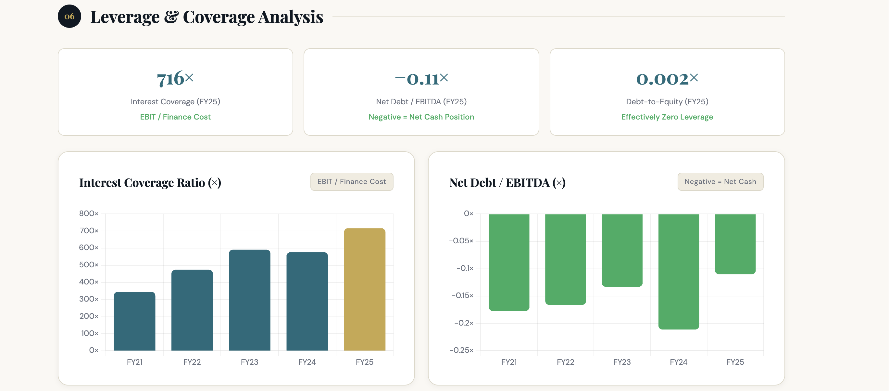

# 📊 ITC Limited – Five-Year Financial Deep Dive


> A comprehensive five-year financial analysis of **ITC Limited (FY2021–FY2025)** covering financial statement analysis, profitability, cash flow analysis, forecasting, valuation, leverage assessment, and strategic business insights through an Excel-based financial model.

---

## 📖 Project Overview

This project presents an in-depth financial analysis of **ITC Limited**, one of India's leading diversified conglomerates. Using five years of publicly available financial statements, the analysis evaluates the company's financial performance, operational efficiency, liquidity, capital structure, and future growth prospects.

The project combines quantitative financial modeling with business analysis to assess ITC's financial health through ratio analysis, profitability evaluation, cash flow assessment, forecasting, and valuation techniques. The analysis concludes with strategic recommendations supported by data-driven insights.

---

## 🎯 Project Objectives

- Analyze ITC Limited's financial performance over a five-year period (FY2021–FY2025).
- Evaluate profitability, liquidity, solvency, and operational efficiency using key financial ratios.
- Examine trends in revenue, expenses, margins, assets, liabilities, and cash flows.
- Forecast future financial performance using historical trends and financial modeling techniques.
- Estimate the company's cost of capital (WACC) and assess value creation using Economic Value Added (EVA).
- Provide data-driven business insights and strategic recommendations based on the analysis.

---

## 🛠️ Tools & Techniques

| Category | Tools / Techniques |
|----------|--------------------|
| Financial Modeling | Microsoft Excel |
| Financial Statements | Income Statement, Balance Sheet, Cash Flow Statement |
| Financial Analysis | Ratio Analysis, Trend Analysis, Common-Size Analysis |
| Valuation | WACC, EVA |
| Forecasting | Revenue & Financial Forecasting |
| Visualization | Excel Charts & Dashboards |
| Reporting | Interactive HTML Report, PDF Report |

---

# 📸 Project Preview

## Company Overview



---

## Executive KPI Dashboard



---

## Revenue & Profitability Analysis



---

## Expense Breakdown



---

## Margin Trend Analysis



---

## Balance Sheet Analysis



---

## Cash Flow Analysis



---

## Leverage Analysis



---

# 📈 Key Business Insights

### 📊 Revenue & Profitability
- Evaluated five-year revenue, PBT, and PAT trends to understand ITC's financial growth and profitability.
- Analyzed operating performance using EBITDA, EBIT, and Net Profit Margin trends.

### 💰 Cost Structure
- Examined major operating expenses and identified their impact on overall profitability across multiple financial years.

### 🏦 Financial Position
- Assessed the composition of assets, liabilities, and shareholders' equity to evaluate financial stability and capital allocation.

### 💵 Cash Flow Performance
- Analyzed operating, investing, and financing cash flows along with Free Cash Flow (FCF) generation to assess liquidity and sustainability.

### ⚖️ Capital Structure & Leverage
- Evaluated leverage ratios, debt servicing capability, and financial risk using key solvency metrics.

### 🔮 Forecasting & Valuation
- Developed financial forecasts based on historical trends.
- Estimated the Weighted Average Cost of Capital (WACC) and assessed shareholder value creation using Economic Value Added (EVA).

---

# 📂 Repository Structure

```text
ITC-Financial-Deep-Dive/
│
├── images/                  # Project screenshots
├── financial-model/         # Excel financial models and forecasts
├── reports/                 # PDF and interactive HTML reports
├── README.md
└── LICENSE
```

---

# 💼 Skills Demonstrated

- Financial Statement Analysis
- Financial Modeling in Microsoft Excel
- Ratio Analysis
- Profitability & Margin Analysis
- Cash Flow Analysis
- Forecasting & Scenario Analysis
- WACC & Economic Value Added (EVA)
- Business Strategy & Financial Interpretation
- Data Visualization & Dashboard Design
- Business Report Writing

---

# 🚀 Future Enhancements

- Develop an interactive Power BI dashboard for financial performance monitoring.
- Automate financial ratio calculations using Python.
- Extend the valuation model with Discounted Cash Flow (DCF) analysis.
- Benchmark ITC's financial performance against major FMCG competitors.

---

# 👨‍💻 Author

**Mayank Bhatt**

MBA (Artificial Intelligence & Data Science)

Interested in **Business Analytics, Product Management, and Strategy Consulting.**

If you found this project interesting, feel free to ⭐ star the repository.